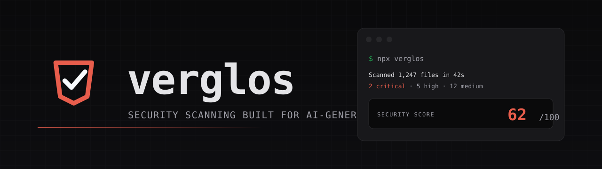

<p align="center">
  
</p>

<p align="center">
  <a href="https://www.npmjs.com/package/verglos">
    
  </a>
  <a href="https://www.npmjs.com/package/verglos">
    
  </a>
  <a href="https://github.com/Top-Notchh-Solutions/verglos-cli/blob/main/LICENSE">
    
  </a>
  <a href="https://nodejs.org">
    
  </a>
  <a href="https://verglos.com">
    
  </a>
</p>

<p align="center">
  <strong>Verglos scans your repo, spots the security issues AI coding agents commonly introduce, and shows you the fix.</strong><br>
  <sub>SAST + SCA in one CLI. Runs 100% locally. Your source never leaves the machine. Free tier is fully unlocked, permanently.</sub>
</p>

<p align="center">
  <a href="#quick-start">Quick start</a> ·
  <a href="#what-verglos-catches">What it catches</a> ·
  <a href="#commands">Commands</a> ·
  <a href="#ci-usage">CI usage</a> ·
  <a href="#plans">Plans</a> ·
  <a href="#configuration">Config</a> ·
  <a href="https://verglos.com/account/docs">Full docs →</a>
</p>

---

## Quick start

```bash
npx verglos
```

That's it. Verglos scans the current directory, prints a summary, and writes `verglos-report.html` + `verglos-report.json` next to your code. No install, no config, no signup.

### What you'll see

```
Scanning project... (42s)

  SECURITY SCORE                                          62 / 100

  Critical  2   secrets · deps
  High      5   injection · misconfig
  Medium    12  ai-patterns · misconfig
  Low       31  ai-patterns · injection
  Info      8   misconfig

  AI-authored     ~68% (agent artifacts, git trailers, commit shape)
  Density ratio   1.9× more findings per LOC in AI-authored files

  Full report:  verglos-report.html
```

Open the HTML to drill into every finding, or ship the JSON to CI.

---

## What Verglos catches

Verglos ships **SAST** (static application security testing — code-side detectors) and **SCA** (software composition analysis — dependency + supply-chain) in one CLI. AI-provenance is layered on top; DAST (runtime testing) is deliberately out of scope.

<table>
  <thead>
    <tr>
      <th align="left">Category</th>
      <th align="left">Domain</th>
      <th align="left">Detectors</th>
    </tr>
  </thead>
  <tbody>
    <tr>
      <td rowspan="4"><b>SAST</b><br><sub>code-side</sub></td>
      <td><b>Secrets</b></td>
      <td>AWS access keys, Stripe live/test keys, GitHub tokens, RSA/EC/OpenSSH private keys — in-file and across the last 50 commits of git history</td>
    </tr>
    <tr>
      <td><b>Injection</b></td>
      <td>SQL, command, prototype pollution, XSS sinks — pattern-matched with confidence scoring</td>
    </tr>
    <tr>
      <td><b>Misconfig</b></td>
      <td><code>.env</code> in git, exposed <code>.git/</code>, permissive CORS, missing security headers, unsafe cookie flags</td>
    </tr>
    <tr>
      <td><b>AI patterns</b></td>
      <td><code>eval</code>, <code>dangerouslySetInnerHTML</code>, unsafe <code>child_process</code>, insecure prompt-injected code paths</td>
    </tr>
    <tr>
      <td rowspan="3"><b>SCA</b><br><sub>supply-chain</sub></td>
      <td><b>Dependencies</b></td>
      <td>OSV / CVE lookups on <code>package-lock.json</code>, top 50 packages, with severity mapping</td>
    </tr>
    <tr>
      <td><b>Vendored libs</b></td>
      <td>Cross-references <code>public/libraries/</code>, <code>vendor/</code>, and <code>*.min.js</code> filenames against OSV — the CVEs <code>npm audit</code> can't see because the code is checked in, not installed</td>
    </tr>
    <tr>
      <td><b>Supply chain</b></td>
      <td>Slopsquat (AI-hallucinated packages that don't exist on npm) + typosquat (Levenshtein-close to a top-200 package name)</td>
    </tr>
    <tr>
      <td><b>AI provenance</b></td>
      <td>—</td>
      <td>Per-file signal aggregation → repo-level <code>aiAuthoredPercent</code>. Signals: git trailers (Co-Authored-By), commit shape (fast + large + multi-file), code shape (uniform docstrings, zero TODOs), agent artifacts (<code>.cursor/</code>, <code>.claude/</code>, <code>CLAUDE.md</code>)</td>
    </tr>
  </tbody>
</table>

---

## Install

`npx` is recommended — it pins to the latest published version automatically.

```bash
npx verglos             # one-off, no install
npm i -g verglos        # global (avoids the network round-trip)
pnpm add -D verglos     # in a project
```

Requires **Node.js 20 or newer**. macOS, Linux, and Windows all supported.

---

## Commands

Every command with an example. `verglos --help` also lists them. In-app docs (with copy buttons) live at **[verglos.com/account/docs](https://verglos.com/account/docs)**.

### `verglos scan` — full security scan

```bash
verglos scan                   # standard scan
verglos scan --watch           # re-scan on file changes
verglos scan --quiet           # no terminal output; reports still written
verglos scan --all             # include low-confidence findings
verglos scan --strict          # include test-file findings in the score
verglos scan --no-provenance   # skip AI-authorship analysis (fastest)
verglos scan --verify-secrets  # ping GitHub/Stripe to prove matched keys are live
```

Writes `verglos-report.html` (open in a browser) and `verglos-report.json` (ship to CI or a dashboard).

### `verglos score` — score only

```bash
verglos score                  # prints 0-100 score, nothing else
```

Useful for shell pipelines: `if [ "$(verglos score)" -lt 70 ]; then …`

### `verglos ci` — build gate

```bash
verglos ci                     # blocks on any critical (Free)
verglos ci --threshold 80      # blocks if score < 80 (Pro)
verglos ci --quiet             # suppress output
```

Free tier still fails on criticals — Verglos is genuinely useful in CI at $0. Threshold enforcement is Pro.

### `verglos fix` — auto-remediation `Pro`

Framework-aware fixes. Today: security headers on Next.js (`next.config.js` patch or `verglos-security-headers.ts` file). More rules land every release.

```bash
verglos fix
```

### `verglos secrets` · `verglos deps` — focused scans

```bash
verglos secrets                # secrets only (fastest, <5s on most repos)
verglos deps                   # dependency CVEs only
```

### `verglos login` · `verglos whoami` · `verglos activate`

```bash
verglos login                  # device-code sign-in (opens browser, prints a short code)
verglos whoami                 # show plan, license (masked), renewal, machine
verglos activate <key>         # non-interactive activation (for CI)
verglos activate $KEY --ci     # exit 2 on failure — job fails fast
```

Sample `whoami` output:

```
  You:      you@example.com
  Plan:     PRO
  License:  vg_xxxx…yyyy
  Renewal:  Jan 15, 2027 (in 365 days)
  Machine:  a1b2c3d4… (this machine)
```

### `verglos monitor register` — continuous CVE monitoring `Pro`

Registers your dep tree. The Verglos server checks OSV hourly and alerts on new criticals to email, Slack, or a generic webhook.

```bash
verglos monitor register --email you@example.com
verglos monitor register --slack https://hooks.slack.com/services/...
verglos monitor register --webhook https://your.app/verglos-alerts
```

### `verglos mcp` — MCP server for AI agents

Exposes Verglos as MCP tools (`verglos_scan`, `verglos_check_package`, `verglos_check_before_write`, `verglos_explain_finding`) to Cursor, Claude Code, Windsurf, and Cline.

```bash
verglos mcp                    # start stdio server (agents call this)
verglos mcp --print-config     # print the JSON to paste into your agent config
```

### `verglos hook` · `verglos precommit` — pre-commit gate

```bash
verglos hook                       # install the pre-commit git hook once
verglos precommit --timeout 2000   # what the hook runs (2s budget by default)
```

### Utilities

```bash
verglos init                   # interactive project config
verglos init -y                # non-interactive
verglos explain                # list every rule
verglos explain D5-003         # explain one rule (here: use of eval)
verglos badge                  # print README badge markdown
verglos update                 # self-upgrade to the latest npm version
```

---

## CI usage

Copy-paste snippet for GitHub Actions:

```yaml
name: Verglos
on: [push, pull_request]

jobs:
  scan:
    runs-on: ubuntu-latest
    steps:
      - uses: actions/checkout@v4
      - uses: actions/setup-node@v4
        with: { node-version: 20 }

      # Free tier — blocks on criticals, works without a key
      - run: npx verglos ci

      # Pro tier — blocks on threshold too. Requires a repo secret.
      # - run: npx verglos activate "$VERGLOS_LICENSE_KEY" --ci
      #   env: { VERGLOS_LICENSE_KEY: ${{ secrets.VERGLOS_LICENSE_KEY }} }
      # - run: npx verglos ci --threshold 80
```

`activate --ci` exits with code 2 on invalid or expired keys, so the job fails fast instead of running the whole scan without Pro features.

---

## Plans

| | Free | Pro |
|---|---|---|
| Full scan (every detector) | Yes | Yes |
| AI-provenance layer | Yes | Yes |
| Slopsquat / typosquat | Yes | Yes |
| MCP server | Yes | Yes |
| Pre-commit hook | Yes | Yes |
| Local HTML + JSON report | Yes | Yes |
| CI mode (block on criticals) | Yes | Yes |
| **CI mode with score threshold** | — | Yes |
| **`verglos fix` — auto-remediation** | — | Yes |
| **Continuous CVE monitoring** (email / Slack / webhook) | — | Yes |
| **Price** | $0 forever | $29 / month |

Upgrade at **[verglos.com/checkout](https://verglos.com/checkout)**. One-time UPI payment, month-to-month, no lock-in.

_Studio ($199/mo — signed attestations, SBOM export, `verglos rotate`) is on the roadmap for v1.5. Sign up for early access at [verglos.com](https://verglos.com)._

---

## Configuration

Sane defaults. Customize with a `.verglos.config.js` in your repo root:

```js
// .verglos.config.js
module.exports = {
  // Add project-specific ignore patterns (glob syntax)
  ignorePaths: ["**/fixtures/**", "**/legacy/**"],

  // Block CI when a critical is found (default: true)
  failOnCritical: true,

  // Block CI when the composite score falls below this (Pro; default: 60)
  failThreshold: 80,

  // How many commits back the secrets detector walks (default: 100)
  secretScanDepth: 100,
};
```

Or drop a `.verglosignore` file for path-only ignores — same syntax as `.gitignore`.

### Environment variables

| Variable | Effect |
|---|---|
| `VERGLOS_API_URL` | Override the server (default: `https://verglos.com`) |
| `VERGLOS_TELEMETRY=0` | Disable anonymous scan telemetry |
| `VERGLOS_PROVENANCE_FILE_CAP` | Override the 300-file cap on provenance analysis (raise for exhaustive scans, lower for speed) |
| `VERGLOS_LICENSE_KEY` | Consumed by `verglos activate --ci` in GitHub Actions |
| `VERGLOS_AS_PLAN` | _Founder only._ Simulate a plan (`free` / `pro`) for testing |

---

## Privacy

Verglos runs 100% locally. **Your source code is never uploaded.**

Anonymous scan telemetry (event ID, CLI version, Node version, platform, finding counts, project fingerprint hash, duration) is POSTed to `verglos.com/api/v1/telemetry/scan` after each scan. No source, no file paths, no findings text, no identity, no license key. Disable per-invocation with `--no-telemetry` or globally with `VERGLOS_TELEMETRY=0`.

Full disclosure: **[verglos.com/account/docs#privacy](https://verglos.com/account/docs#privacy)**.

---

## Repo layout

This is the CLI monorepo (`Top-Notchh-Solutions/verglos-cli`). Six packages, all published under the `@verglos` scope plus the `verglos` bin:

| Package | What it does |
|---|---|
| **`packages/cli`** | The `verglos` bin — commander CLI, prints reports, wires everything |
| **`packages/scanner`** | Detectors, provenance analysis, walker, orchestrator |
| **`packages/reporter`** | Terminal / HTML / JSON output |
| **`packages/shared`** | Types, config schema, fingerprint, plan matrix |
| **`packages/entitlement`** | License verification client, capability caching |
| **`packages/mcp`** | Model Context Protocol server for AI coding agents |

The web app + billing lives in a separate repo (`verglos-web`). Docs and planning notes live in `Top-Notchh-Solutions/verglos-archive` (private).

### Local development

Requires **Node 20+** and **pnpm 9**.

```bash
pnpm install
pnpm build
pnpm typecheck
```

Built bin: `packages/cli/dist/index.js` (invoke with `node <path>` or symlink into `$PATH`).

Releases are cut via a `chore(release): X.Y.Z` PR that bumps every `package.json`, then a tag pushed from `main` triggers `.github/workflows/publish.yml` (publishes all six packages with npm provenance).

---

## Support

- **Website** — [verglos.com](https://verglos.com)
- **Account & docs** — [verglos.com/account](https://verglos.com/account) · [verglos.com/account/docs](https://verglos.com/account/docs)
- **npm** — [npmjs.com/package/verglos](https://www.npmjs.com/package/verglos)
- **Issues** — [github.com/Top-Notchh-Solutions/verglos-cli/issues](https://github.com/Top-Notchh-Solutions/verglos-cli/issues)
- **Email** — [support@verglos.com](mailto:support@verglos.com)

---

<sub>Verglos is built by Anurag Yadav. Apache-2.0 licensed. Made for developers shipping with AI coding agents.</sub>
